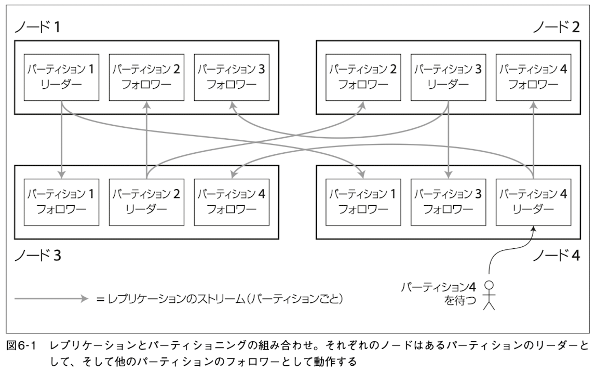

# ６章 パーティショニング

## 本章の概要

パーティショニング：非常に大規模なデータを扱うためにデータを分割する手法。

シェアードナッシングクラスタの別々のノードにパーティションを配置できる(複数のマシンに負荷を分散させる)ことで、スケーラビリティを持つことができる

前章のレプリケーションとの違いとパーティショニングの手法、パーティション内のデータが偏った時の対応方法(リバランシング)について述べられている

## 用語

- パーティショニング：巨大なデータベースを小さなサブセット（パーティション）に分割する方法。
- パーティション：データベースを小さく分割したサブセット。パーティショニングでは、それぞれのパーティションを別々のノードに割り当てる。
- シェアードナッシング：水平スケーリングやスケールアウトとも呼ばれる。実現するために特別なハードウェアは必要ない
- ノード：シェアードナッシングアーキテクチャにおいて、データベースソフトウェアを実行している各(仮想)マシンのこと。独立にマシンの持つCPU, RAM, ディスクを利用する。ノード間の調整はネットワークを通じてソフトウェアレベルで行われる

### パーティションの言い換え

ソフトウェアやインフラによって、パーティションと同じ概念を別の言葉で表現することもある。本書では、最も一般的な「パーティション」を使って説明されているが、以下の言葉にも置き換えられる

- シャード: 検索エンジン(具体的な ElasticSearch, Solr といったソフトウェアも含む)の文脈やMongoDB において
- vnode: Cassandra, Riak
- リージョン: HBase
- Bigtable: タブレット
- vBucket: Couchbase

## 6.1 パーティショニングとレプリケーション

### パーティショニングのメリット

パーティショニングのメリット: スケーラビリティ

- 単一のパーティションに対して処理を行うクエリの場合、各ノードは独立にノード内のパーティションに対してクエリを実行できるのえ、ノードを実行することで、クエリのスループットをスケールさせられる


### パーティショニングとレプリケーションの併用

パーティショニングは各パーティションが複数ノードに保存されることから、レプリケーションと組み合わされる

- 耐障害性のため
- 1ノードに複数のパーティションが保存されることもあるし、あるパーティションのリーダーと別のパーティションのフォロワーを兼務することもある




## 6.2 キー・バリューデータのパーティショニング

目標：データとクエリの負荷をノード間で __均等__ に分散させること

- 均等に負荷を分散させれた場合：（レプリケーションとについて無視するなら、）1ノードと10ノードを比べた場合、ノードのマシンスペックが同じなら、10ノードにすると10倍のデータ量を格納でき、10倍のスループットが得られる
- 均等に負荷を分散させれてない場合：一部のパーティションが他に比べて多くのデータを持ち、クエリを受け付けている状態
  - この状態: skew(スキュー)
  - 負荷が集中しているパーティション: ホットスポット

パーティショニングの方法について以下に記載する

### キーの範囲に基づくパーティショニング

- 連続的なキーの範囲（何らかの下限から上限）を描くパーティションに割り当てる
- パーティションの境界は管理者が決めてもいいし、データベースに自動的に選択させても良い
- Pros: キーの並び順でソートできる => 範囲検索が容易
- Cons: アクセスパターンによってはホットスポットが生じる

#### 例1 レンジパーティション

MySQL だと以下のような感じ。RDBだと他にもリストパーティションというのもある。事前にパーティションに含めるvalueを複数決めておいて、該当valueは同一パーティションに含まれるという仕組み

```sql
CREATE TABLE employees (
    id INT NOT NULL,
    ...
)
PARTITION BY RANGE (id) (
    PARTITION p0 VALUES LESS THAN (6),
    PARTITION p1 VALUES LESS THAN (11),
    PARTITION p2 VALUES LESS THAN (16),
    PARTITION p3 VALUES LESS THAN (21),
    ...
);
```

#### 例2 日毎にパーティションを切る

Hive や Presto などでは、大規模なデータを扱う && データの保持期限を決めることが多いので、日毎・時間ごとにパーティションを切る。

### キーのハッシュに基くパーティショニング

多くの分散データストアではハッシュ関数を使ってパーティショニングを実現する。それぞれのパーティションにパーティションに利用するハッシュ値の範囲を割り当て、該当パーティションにデータが保存されるようにする。(ハッシュパーティショニング)

- 利用するハッシュ関数: パーティショニングの用途だけであるため、暗号として強力である必要はない
- 例：Cassandra, MongoDB では MD5

TODO: 図6-3 を貼る

- Pros: 優れたハッシュ関数を使うことで、一様にデータを分散させれる。よってスケーラブル
- Cons: 範囲検索が苦手。例えば日付が 2023/8/18 - 2023/8/31 のデータを引っ張ってきたくても、それぞれのデータは別のパーティションに保存され、ソートもされてないため、パーティションを跨いだ検索の必要がある => 検索効率が悪い

#### コンシステントハッシュ法

パーティション間で均等にキーを分散させれる ≒ パーティションの境界を均等にしたり、擬似乱数的に選択したりできる。  
後者の「擬似乱数的に選択する」手法をコンシステントハッシュ法と呼ぶ。

ただし、このアプローチはデータベースではうまくいかないことが多い。  
また、コンシステントハッシュ法 ≠ ハッシュパーティショニング である。データベースのドキュメント上で「コンシステントハッシュ法」に触れている場合もハッシュパーティショニングのことを言っていることが多々ある。

うまくいかない: リバランスの際の負荷が大きい(6.4.1.1 より)
- ノード数を増やすと、擬似乱数的(例えば剰余を使う)にデータを配置するパーティションを選ぶとき、多くのデータを移動させる必要が出てくる
- 多くのデータを移動させる => リバランスの負担が極めて大きい

### Cassandra におけるパーティショニング戦略

範囲に基づくパーティショニングとハッシュに基くパーティショニングの間で妥協を成立させるために __複合プライマリキー__ を宣言できる。

下記のようなパーティショニング戦略により、先頭列の値を確定させていれば、他の列については範囲検索を実現できる。

- キーの先頭部分: ハッシュをパーティションの決定に利用
- 他の列: SSTable内のデータをソートするための連結インデックスとして利用

### skewとホットスポットの軽減

ハッシュパーティショニングを使っても、大規模なデータを扱う場合、パーティショニングに使っている同一キーに対して大量のクエリが実行されることで、ホットスポット・skewが発生することはある。

対策として、skew を抑えることはアプリケーションの役割にする。
例えば、あるキーにデータが非常に集中するのであれば、キーにランダムな数値をprefix or suffix に追加することで別々のパーティションに負荷を分散できる。

ただし、書き込みの負荷はこれで軽減できるものの読み込みの負荷が複数パーティションを参照することで大きくなってしまう。
このようなトレードオフも含めてアプリケーション側でも負荷を考慮する必要が出てくることもある。

## 6.3 パーティショニングとセカンダリインデックス

セカンダリインデックス: レコードをユニークに特定するものではなく、特定の値を検索する方法の1つ。 「RDBにおけるプライマリキー以外に貼られているインデックス」や「検索エンジンにおける検索」がわかりやすい例。パーティションに対応づけられない。

セカンダリインデックスを持つDBのパーティショニングのアプローチ
- ドキュメントDBのパーティショニング
- 語ベースのパーティショニング

### ドキュメントによるセカンダリインデックスでのパーティショニング

RDB だけでなく、MongoDB,Cassandra, ElasticSearch, Solr などで多く採用

 手法

- 各パーティションは完全に分離されている
- 自身のパーティション内のドキュメントだけをカバーするインデックス（セカンダリインデックス; パーティション内のドキュメントだけ管理するので __ローカルインデックス__ とも呼ばれる）を管理
- 注意点: セカンダリインデックスを利用したい場合、 __全てのパーティションにクエリを送信し、得られた結果を結合__ する必要がある（パーティション内の検索をすることより高負荷）
  - このクエリのアプローチを スキャッタ/ギャザー という
  - スキャッタ/ギャザー: リクエストを処理するために必要な演算をシャーディングする仕組み
  - [分散システムデザインパターン ―コンテナを使ったスケーラブルなサービスの設計](https://www.oreilly.co.jp//books/9784873118758/) でもう少し詳細に触れられているらしい


TODO: 図6-4を貼る

### 語によるセカンダリインデックスでのパーティショニング

ローカルインデックスに対して、全てのパーティションのデータをカバーするインデックスを構築するアプローチもある  
=> グローバルインデックス

通常、グローバルインデックスの更新は非同期で行われる

#### グローバルインデックスの手法

全てのグローバルインデックスを単一ノードのパーティションに保存すると、そのノードがボトルネックになる。そこで語によるセカンダリインデックスを採用する。

- 検索する語の先頭文字を使って、文字の範囲ごとにグローバルインデックスを保存するノードを決定する。
- ↑語のハッシュでパーティショニングすることもできる
  - ハッシュを使うことで負荷の分散はさらに均等になる(書き込み負荷が小さくなる)。一方、文字をそのまま使うと範囲に対するスキャンが有利に(該当パーティション内だけで検索が完結する)

__語__ は「全文検索インデックス」からきている。ドキュメント中に現れる全ての単語のことを指す。

TODO: 図6-5を貼る


### DynamoDB におけるセカンダリインデックス

DynamoDB ではグローバルインデックスは通常、1秒未満で更新される（時折、もっと時間がかかることもある）

ローカルインデックス
- テーブル作成後の追加ができない
- 結果生合成、強い整合性の両方をサポート
- 当たり前だが、パーティションキーはテーブルの下と同じ。ソートキー（検索に利用したいキー）を指定して作成。

グローバルインデックス
- テーブル作成後も追加できる
- 結果生合成のみサポート
- グローバルインデックス用のパーティションキー・ソートキーを指定して作成

## 6.4 パーティションのリバランシング

リバランシング: 負荷をクラスタ内のあるノードから別のノードへ移行するプロセス

運用していて時間が経つにつれ、ノードの負荷の偏りやデータベースのサイズの増大により、リバランシングの必要が出てくることもある。

リバランシングの要求
- リバランシングの終了後、負荷はクラスタ内のノード間で公平に分配されていなければならない
- リバランシングが行われている間、データベースは読み書きを受け続けなければならない
- ノード間を移動させるデータは必要最小限にとどめ、リバランシングが高速に行われ、ネットワーク・ディスクI/Oなどの負荷が最小になるようにする

### 戦略1: パーティション数の固定

ElasticSearch などで採用

- 最初から1ノードあたりで多くのパーティションを保持しておく
- ノードを増やしたら負荷が大きいノードからパーティションを盗む
- (ノード数は増えてもパーティション数はクラスタ内で固定数)
- ノード間を移動するのは、新しいノードに割り当てられたパーティションのみ

TODO: 図6-6を貼る

### 戦略2: 動的なパーティショニング

HBase, MongoDB などで採用。

キーの範囲によるパーティショニングを採用しているDBでは、パーティション数を固定するのは不便であるため、この方法を利用。

- パーティションが設定されたサイズ以上に大きくなったら、パーティションを2つのパーティションに分割し、双方にほぼ半分のデータを含めるようにする
- ↑逆に、データが大量に削除された場合、近接するパーティション同士をマージすることもある
- (Bツリーのトップレベルで生じるマージと似たような処理)

データ量でパーティション数が変わることで、空のデータベースが単一のパーティションでスタートしてしまう問題もある。もちろん、初期のパーティション数を設定できる(__事前分割__)ので、キーの分布がどうなっていくかを予想してパーティション数の初期値を決定する必要がある。

### 戦略3: ノード数に比例するパーティショニング

Cassandra などで採用。

ノードあたりのパーティション数を固定する方法。(Cassandraのデフォルト: 256パーティション)

パーティションの境界をランダムに選択するためにはハッシュパーティションが使われている必要がある。

### 運用: 自動のリバランスと手動のリバランス

著者は「リバランスの処理のどこかには人を介在させると良いかも」と述べている。

完全に自動化されたリバランスは運用負荷を激減できるものの、リバランス自体が負荷がかかる操作であるため、障害のリスクもある。よって、人を介在させることで、そのリスクを低減すると良い、ということ

## 6.5 リクエストのルーティング

クライアントは適切な接続先のノードをどのように判断すればいいか
=> サービスディスカバリのOSSを利用することが一般的。(接続先のノードの選択問題はDBだけの問題ではない)

### アプローチの種類

TODO: 図6-7を貼る

1. クライアントがLBなどを通じて任意のノードに接続できる方法。
    - 接続したノードがリクエスト対象となるパーティションを保持: 直接リクエストを処理
    - 接続したノードがリクエスト対象となるパーティションを保持していない: 適切なノードにリクエストを転送し、適切なノードが結果をクライアントに返す
2. クライアントからの全てのリクエストをルーティング層に送信 -> ルーティング層が適切なノードを判断してリクエストを送る
3. クライアントにパーティショニングとノードへのパーティションの割り当てを認識させる

どの手法を採用するとしても、多くの分散データシステムは ZooKeeper のような独立した協調システムに依存。ルーティングの情報（パーティションとノードのマッピング情報）を保持し、適切なノードの判断をするための情報を協調システムからもらう。
HBase, Solr, Kafka などで ZooKeeper を利用している。(2 のイメージ)

Cassandra ではクラスタの状態の変化を広めるためにノード間で gossipプロトコル を利用。リクエストは任意のノードに送信でき、ノードがリクエストを要求されたパーティションの処理を行うのに適切なノードを転送する。（1 のイメージ）
