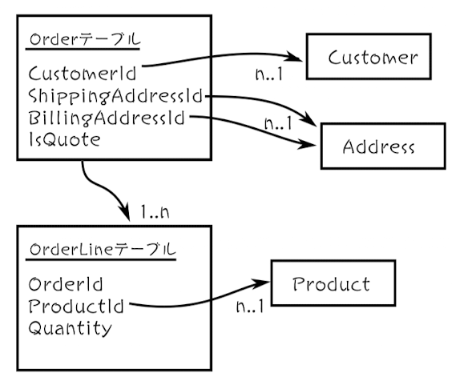
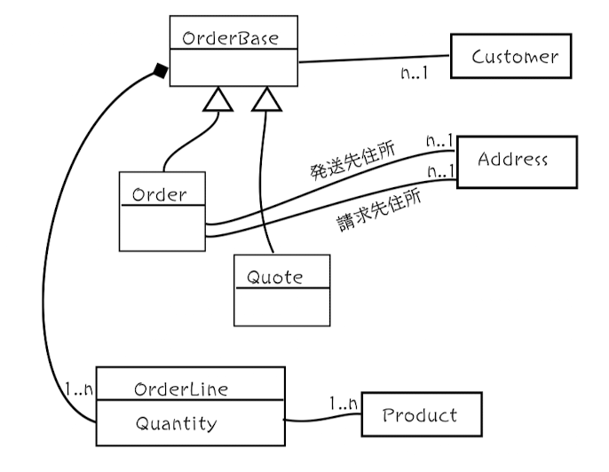

# 第2章 ドメインの理解

## 2.2 データベース駆動設計をしたいという衝動との戦い



- ドメイン駆動設計ではデータベースのスキーマではなく、ドメインから設計を導き出す
- 設計時、上記のようなテーブルを頭に思い浮かべてしまうが、ストレージの実装を考慮せずにモデル化した方がいい
- DDD では **永続性非依存** という。データベース内のデータの表現を気にすることなく、ドメインを正確にモデル化することに集中させてくれる、重要な原則

## 2.3 クラス駆動設計をしたいという衝動との戦い



- モデリングの際、クラス駆動で設計するのはデータベース駆動設計と同じくらい危険
- 上記の図だと、`OrderBase` は現実の世界には存在しない人工的な基底クラス
- 技術的な考えをドメインに押し付けないことが大切

## 2.4 ドメインの文書化

- まずはワークフローの input, output を疑似コードで表してみる

```
Bounded context: Order-Taking

Workflow: "注文"
    トリガー条件:
        見積書を受け取る（見積書は未チェック）
    入力:
        1件の見積書
        商品カタログ
    出力:
        注文
    副作用:
        受領書・発注された注文を顧客に送信
```

もう少し、プログラマチックにする

```ts
Bounded context: Order-Taking

# 注文
# 顧客, 配送, 支払い, 注文明細一覧, 請求額 を持つ
# AND はフィールドを持つということ。Order は CustomerInfo, ShippingAddress, ... などのフィールドを持つ
# あとで出てくる OR はいずれかの値を取りえるということ
# list of <type> は <type> の一覧を持つということ
data Order =
    CustomerInfo
    AND ShippingAddress
    AND BillingAddress
    AND list of OrderLines
    AND AmountToBill

# 注文明細
# 商品, 数量, 金額 を持つ
data OrderLine =
    Product
    AND Quantity
    AND Price

data CustomerInfo = ...
```

## 2.5 ワークフローを深掘りする

- 顧客やステークホルダーと会話して、ワークフローを深ぼる
- ドメインについて学びながら、ユビキタス言語の用語も作っていく

## 2.6 複雑さをドメインモデルで表現する

- 制約条件を表現する。例えば、製品コードや数量は単なる文字列ではなく制約を受ける。このような制約も擬似コードで文書化していく
    - 例: 数量
    - 値域はドメインエキスパートとヒアリングして決めれる

    ```ts
    data OrderQuantity = UnitQuantity OR KilogramQuantity

    # ユニット数
    data UnitQuantity = integer between 1 and 1000
    # 重量
    data KilogramQuantity = decimal between 0.05 and 100.00
    ```

- ライフサイクルを表現する
    - 例: 注文
    - 最初の Order の定義は単純で、ドメインエキスパートがドメインに対してどのような考え方を持っているかを表現できてない
    - 例えば、
      - 最初は検証されてない状態から始まり
      - 次に「検証」され
      - 価格がつけられる
    - この step をドメインモデルに取り込む
    - 1. 検証されてない状態

    ```ts
    data UnvalidatedOrder =
        UnvalidatedCustomerInfo
        AND UnvalidatedShippingAddress
        AND UnvalidatdBillingAddress
        AND list of UnvalidatedOrderline

    data UnvalidatedOrderline =
        UnvalidatedProductCode
        AND UnvalidatedOrderQuantity
    ```

    - 2. 検証後

    ```ts
    data ValidatedOrder =
        ValidatedCustomerInfo
        AND ValidatedShippingAddress
        AND ValidatdBillingAddress
        AND list of ValidatedOrderline

    data ValidatedOrderline =
        ValidatedProductCode
        AND ValidatedOrderQuantity
    ```

    - 3. 価格設定
        - 明細行にそれぞれ価格が関連づけられる
        - 注文全体に AmountToBill(請求額) が関連づけられる

    ```ts
    data PricedOrder =
        ValidatedCustomerInfo
        AND ValidatedShippingAddress
        AND ValidatdBillingAddress
        AND list of PricedOrderLine
        AND AmountToBill

    data PricedOrderLine =
        ValidatedOrderLine
        AND LinePrice
    ```
