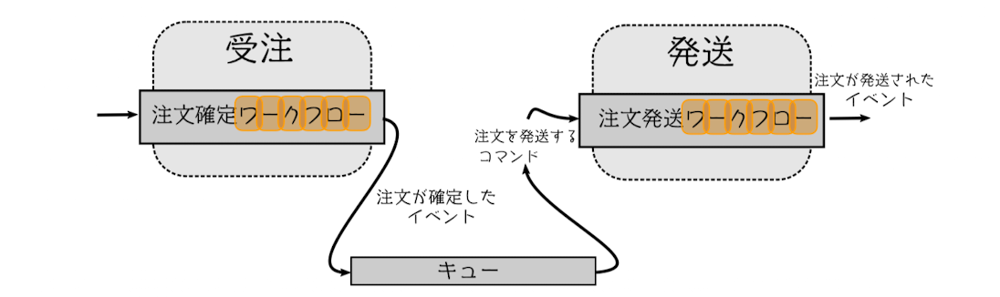
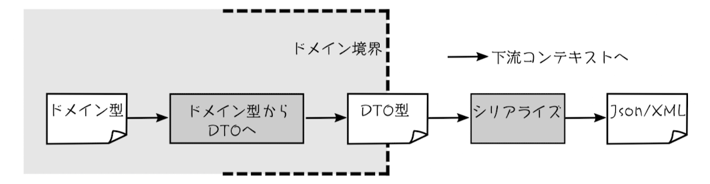
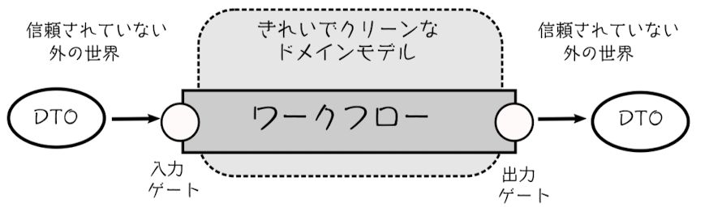
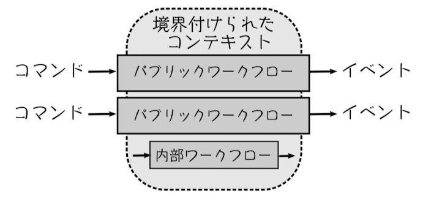
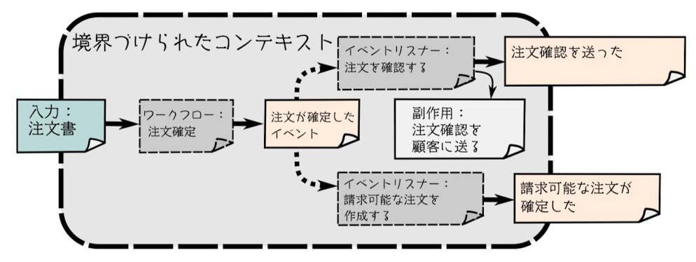
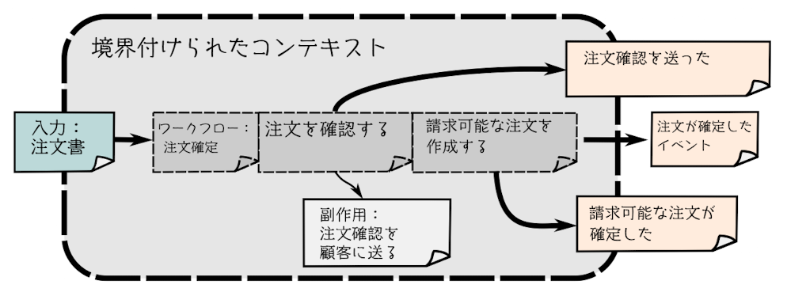

# 第3章 関数型アーキテクチャ

- 関数型ドメインモデルの典型的なソフトウェアアーキテクチャについて紹介
- DDD の「境界づけられたコンテキスト」や「ドメインイベント」をソフトウェアにどう変換していくかも紹介

## 3.2 境界づけられたコンテキストのコミュニケーション

- 図にあるように、別々のコンテキストに属するワークフロー同士はお互いを意識せず、イベントを通じてのみコミュニケーションをとるようにする
- そうすることで、疎結合にする
- インフラは一例でなんでもいい。MQ を使ってもいいし、関数を順に呼び出してもいい

### 3.2.1 境界づけられたコンテキスト間のデータ転送

- コンテキスト間はなんらかの形でインフラを通じて、シリアライズされたオブジェクト（DTO）を使ってデータをやり取りする

### 3.2.2 信頼の境界線と検証

- 境界づけられたコンテキストの境界線は「信頼の境界線」として機能
- ワークフローの最初・最後にゲートを追加して、信頼されたドメイン・信頼されてない外の世界との間の仲介者として機能するようにする
    - すなわち、IO を端に追いやるということ
    - クリーンアーキテクチャなどでも同じような考え方

- 入力ゲートでは、入力がドメインモデルの制約に適合しているか常に検証
- 出力ゲートでは、境界づけられたコンテキストの外にプライベートな情報が漏れないようにすること。
    - コンテキスト間の偶発的な結合を避けるため
    - セキュリティのため、不要な情報を連携しない

## 3.3 境界づけられたコンテキスト間の契約

- 共有カーネル関係：2つのコンテキストがなんらなkの共通のドメイン設計を共有しているため、関係するチームが協力しなければならない場合
    - 共通のライブラリを使っているなど
- コンシューマー駆動契約: 下流のコンテキストが上流のコンテキストに提供して欲しい契約を定義
    - Web API の I/F など
- 腐敗防止層

## 3.4 境界づけられたコンテキストでのワークフロー

- 関数型アーキテクチャでは、ワークフローはそれぞれ1つの関数にマッピングされる
- ワークフローは常に単一の境界づけられたコンテキスト内に含まれている

### 3.4.1 ワークフローのインプット・アウトプット

- ワークフローへの入力は、常にコマンドに関連するデータ
    - 不必要なデータは入力に加えない
- ワークフローの出力は、常に他のコンテキストに伝えるためのイベントのセット

### 3.4.2 境界づけられたコンテキスト内ではドメインイベントを避ける

- 関数型設計では、境界づけられたコンテキスト内で内部的に発生するドメインイベントを持たないようにする
- イベントリスナーを端に追いやる。そうすることで、処理の中でイベントを処理したことを待つのをワークフロー末端にまとめれて保守しやすいということ？（書籍を読んでもわからなかった）

NG

OK

### 3.5 境界づけられたコンテキストの中のコード構造

- オニオンアーキテクチャの紹介
- I/O を端に追いやる
    - I/O をワークフローの開始時 or 終了時にのみ行うようにする
    - こうすることで、ワークフローの内部から I/O 処理をしない -> ドメインのモデリングで I/O にアクセスすることがなくなる(ドメインレイヤーとインフラレイヤーの処理が混同しない)
