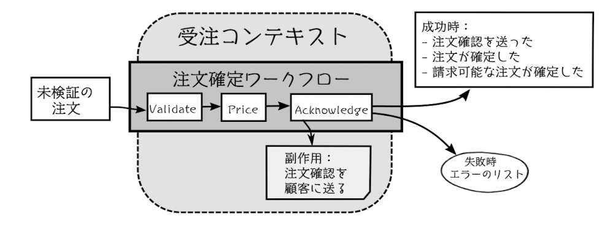
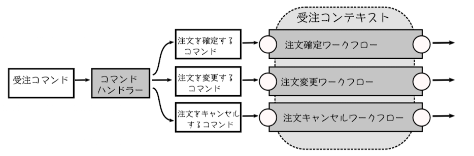
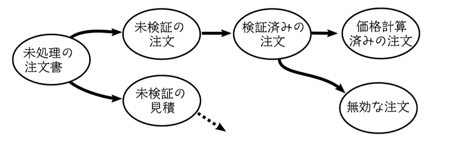

# 第7章 パイプラインによるワークフローのモデリング

ワークフローをモデリングしていく。ワークフローは一連のサブステップで構成されている。
多くのビジネスプロセスは一連の変換処理として考えられる。

ビジネスプロセスを表す「パイプライン」をパイプラインよりさらに小さな「パイプ」の集合体として構築する。



## 7.1 ワークフローの入力

- ワークフローへの入力は常にドメインオブジェクト
- ワークフローの入力はコマンド。コマンドにロジックのために必要なドメインオブジェクトを含める。
- コマンドごとに共通のフィールドも定義する。オブジェクト指向なら基底クラスを継承させて実現するが、関数型では Generics を使って目的を達成する

```ts
// オブジェクト指向アプローチ
class Command {
    timeStamps: number;
    userId: string;
}
class PlaceOrderCommand extends Command {
    data: UnvalidatedOrder
}

// 関数型アプローチ
type Command<T> = {
    data: T;
    timeStamp: number;
    userId: string;
}
type PlaceOrder = Command<UnvalidatedOrder>
```

- 場合によっては、境界づけられたコンテキストのすべてのコマンドが同じ入力チャネルで送信されることもある（ex. MQ Consumer）
- その場合、すべてのコマンドを含む選択型を定義すると良い

```ts
type OrderTakingCommand =
    | PlaceOrder
    | ChangeOrder
    | CancelOrder
```



## 7.2 状態の集合による注文のモデリング

ワークフローのパイプラインを構築する際、パイプごとの状態をモデル化したい。



素朴なアプローチとしては、状態を別々のフラグで表現したモデルを実装する。

```ts
type Order = {
    orderId: OrderId;
    ...
    isValidated: boolean; // 検証時に設定
    isPriced: boolean; // 価格計算時に設定
    amoutToBill?: number; // 価格計算時に設定
}
```

このアプローチの課題は以下

- 状態が暗黙的で、処理に多くの条件付きコードが必要
- いくつかの状態には、他の状態で必要とされないデータがある
- どのフィールドがどのフラグに対応するのか不明確

取り得る各状態のいずれかを取る新しい型を作成するのがより良い方法。
変更時は新しい取り得る型を増やせばいい。既存のコードに修正は入らない。


```ts
type Order =
    | UnvalidatedOrder
    | ValidatedOrder
    | PricedOrder

type UnvalidatedOrder = {
    orderId: OrderId;
    customer: Customer;
    ShippingAddress: Address;
    BillingAddress: Address;
}

type ValidatedOrder = {
    orderId: OrderId;
    customer: Customer;
    ShippingAddress: Address;
    BillingAddress: Address;
    OrderLines: PricedOrderLine[];
}

type PricedOrder = {
    orderId: OrderId;
    customer: Customer;
    ShippingAddress: Address;
    BillingAddress: Address;
    OrderLines: PricedOrderLine[];
    AmoutToBill: BillingAmout;
}
```

## 7.4 型を使ったワークフローの各ステップのモデリング

- パイプのステップごとに実装していく
- モデルの取り得る状態を変化させる

```ts
// 注文の検証ステップ
const checkProductCodeExists = (productCode: ProductCode): bool => {
}

// 値の変換が入るケースは Result 型で変換できた場合、できなかった場合の値を持たせる
const checkAddressExists = (address: UnvalidatedAddress): Result<CheckedAddress, AddressValidationError> => {
}

type ValidateOrder = (order: UnvalidatedOrder) => Result<ValidatedOrder, ValidationError>
const validate: ValidateOrder = (order: UnvalidatedOrder): Result<ValidatedOrder, ValidationError> => {
    // check... メソッドを使った実装
}
```

## 7.6 ステップからワークフローを合成する

各ステップが実装できたら、ステップの出力 -> ステップの入力 に接続することで、全体のワークフローを構築できる

```ts
// ValidateOrder -> PriceOrder ->  AcknowledgeOrder
//                             |
//                             |_> CreateEvents
type ValidateOrder = (order: UnvalidatedOrder) => Result<ValidatedOrder, ValidationError>

type PriceOrder = (order: ValidatedOrder) => Result<PricedOrder, PricingError>

type AcknowledgeOrder = (order: PricedOrder) => OrderAcknowledgementSent | null

type CreateEvents = (order: PricedOrder) => PriceOrderEvent[]
```
